# ERD (Entity Relationship Diagram) - Sistem E-Aduan JIM 3.0

## Ringkasan Database
Sistem E-Aduan ini menggunakan **MariaDB/MySQL** dengan total **16 tables utama**:
- **Core Tables**: 5 tables (Users, Aduan, Lampiran, etc.)
- **Workflow Tables**: 4 tables (Workflow History, Kembalikan, Tindakan, Komen)
- **Notification Tables**: 2 tables (Notifikasi Pengadu & Pentadbir)
- **Reference/Lookup Tables**: 2 tables (Negeri, Kategori)
- **Audit/Monitoring Tables**: 3 tables (Audit Logs, Performance, Alerts)

---

## ERD Diagram (Mermaid Format)

```mermaid
erDiagram
    %% ============================================
    %% CORE ENTITIES
    %% ============================================
    
    NEGERI {
        int id PK
        varchar nama
        varchar kod UK
    }
    
    KATEGORI_ADUAN {
        int id PK
        varchar nama
        text keterangan
        enum status
    }
    
    PENGADU {
        int id PK
        varchar nama_penuh
        varchar no_kad_pengenalan
        varchar email UK
        varchar password
        varchar no_telefon
        text alamat
        varchar poskod
        varchar daerah
        int negeri_id FK
        datetime tarikh_daftar
        datetime last_login
        enum status
        varchar google_id
        varchar facebook_id
        varchar foto_profil
    }
    
    PENTADBIR {
        int id PK
        varchar nama_penuh
        varchar email UK
        varchar password
        varchar no_telefon
        enum workflow_role
        int negeri_id FK
        varchar jabatan
        enum status
        datetime tarikh_daftar
        datetime last_login
        varchar foto_profil
    }
    
    ADUAN {
        int id PK
        int id_pengadu FK
        varchar tajuk_aduan
        text butiran_aduan
        enum jenis_aduan
        int kategori_aduan_id FK
        varchar kategori_lain
        int negeri_id FK
        varchar daerah
        varchar poskod
        text lokasi
        varchar anggaran_bilangan_pati
        time waktu_operasi_dari
        time waktu_operasi_hingga
        varchar warganegara
        text jenis_premis
        enum workflow_stage
        enum status_kelengkapan
        int pegawai_penerima_id FK
        varchar pegawai_penerima_nama
        int pengarah_id FK
        varchar pengarah_nama
        int pegawai_negeri_id FK
        varchar pegawai_negeri_nama
        datetime tarikh_aduan
        datetime tarikh_semakan
        datetime tarikh_agihan
        datetime tarikh_kembalikan
        datetime tarikh_selesai
        datetime tarikh_ditolak
    }
    
    LAMPIRAN {
        int id PK
        int aduan_id FK
        varchar nama_fail
        varchar fail_path
        varchar jenis_fail
        int saiz_fail
        datetime tarikh_muat_naik
    }
    
    VIDEO_LAMPIRAN {
        int id PK
        int aduan_id FK
        varchar nama_fail
        varchar fail_path
        varchar jenis_fail
        bigint saiz_fail
        int durasi
        enum dimuat_naik_oleh
        int dimuat_naik_oleh_id
        varchar dimuat_naik_oleh_nama
        datetime tarikh_muat_naik
    }
    
    %% ============================================
    %% WORKFLOW ENTITIES
    %% ============================================
    
    ADUAN_WORKFLOW_HISTORY {
        int id PK
        int aduan_id FK
        varchar stage_dari
        varchar stage_ke
        int pentadbir_id FK
        varchar pentadbir_nama
        varchar workflow_role
        varchar tindakan
        text catatan
        datetime tarikh_tindakan
    }
    
    ADUAN_KEMBALIKAN {
        int id PK
        int aduan_id FK
        text sebab
        int pentadbir_id FK
        varchar pentadbir_nama
        datetime tarikh_kembalikan
        datetime tarikh_diperbaiki
        enum status
    }
    
    TINDAKAN_ADUAN {
        int id PK
        int aduan_id FK
        int pentadbir_id FK
        varchar pentadbir_nama
        text tindakan
        enum status_tindakan
        datetime tarikh_tindakan
        datetime tarikh_selesai
    }
    
    KOMEN {
        int id PK
        int aduan_id FK
        int user_id
        enum user_type
        varchar user_nama
        text komen
        datetime tarikh_komen
    }
    
    %% ============================================
    %% NOTIFICATION ENTITIES
    %% ============================================
    
    NOTIFIKASI_PENGADU {
        int id PK
        int pengadu_id FK
        int aduan_id FK
        varchar jenis_notifikasi
        varchar tajuk
        text mesej
        tinyint dibaca
        datetime tarikh_cipta
    }
    
    NOTIFIKASI_PENTADBIR {
        int id PK
        int id_pentadbir FK
        int id_aduan FK
        varchar jenis_notifikasi
        varchar tajuk
        text mesej
        tinyint sudah_dibaca
        datetime tarikh_dicipta
        datetime tarikh_dibaca
    }
    
    %% ============================================
    %% AUDIT & MONITORING ENTITIES
    %% ============================================
    
    AUDIT_LOGS {
        bigint id PK
        varchar action
        enum user_type
        int user_id
        json details
        varchar ip_address
        text user_agent
        timestamp created_at
    }
    
    SLOW_QUERIES {
        int id PK
        text query_sql
        decimal query_time
        varchar page
        int user_id
        varchar user_type
        varchar client_ip
        timestamp created_at
    }
    
    NEWS_UPDATES {
        int id PK
        varchar title
        text content
        text excerpt
        enum category
        enum status
        int created_by FK
        datetime published_at
        datetime created_at
        datetime updated_at
    }
    
    SAVED_SEARCHES {
        int id PK
        varchar user_id
        enum user_type
        varchar search_name
        varchar search_keyword
        varchar filter_status
        int filter_category FK
        int filter_negeri FK
        varchar filter_priority
        date date_from
        date date_to
        varchar sort_by
        boolean is_default
        timestamp created_at
        timestamp last_used
        int use_count
    }
    
    %% ============================================
    %% RELATIONSHIPS
    %% ============================================
    
    %% Pengadu Relationships
    PENGADU ||--o{ ADUAN : "membuat"
    PENGADU ||--o| NEGERI : "tinggal di"
    PENGADU ||--o{ NOTIFIKASI_PENGADU : "menerima"
    
    %% Pentadbir Relationships
    PENTADBIR ||--o| NEGERI : "bertugas di"
    PENTADBIR ||--o{ ADUAN : "pegawai_penerima"
    PENTADBIR ||--o{ ADUAN : "pengarah"
    PENTADBIR ||--o{ ADUAN : "pegawai_negeri"
    PENTADBIR ||--o{ ADUAN_WORKFLOW_HISTORY : "melakukan"
    PENTADBIR ||--o{ ADUAN_KEMBALIKAN : "kembalikan"
    PENTADBIR ||--o{ TINDAKAN_ADUAN : "bertindak"
    PENTADBIR ||--o{ NOTIFIKASI_PENTADBIR : "menerima"
    PENTADBIR ||--o{ NEWS_UPDATES : "menulis"
    
    %% Aduan Core Relationships
    ADUAN }o--|| KATEGORI_ADUAN : "berkategori"
    ADUAN }o--|| NEGERI : "berlaku di"
    ADUAN ||--o{ LAMPIRAN : "mempunyai"
    ADUAN ||--o{ VIDEO_LAMPIRAN : "mempunyai"
    ADUAN ||--o{ KOMEN : "mempunyai"
    ADUAN ||--o{ ADUAN_WORKFLOW_HISTORY : "mempunyai"
    ADUAN ||--o{ ADUAN_KEMBALIKAN : "dikembalikan"
    ADUAN ||--o{ TINDAKAN_ADUAN : "mempunyai"
    ADUAN ||--o{ NOTIFIKASI_PENGADU : "menghasilkan"
    ADUAN ||--o{ NOTIFIKASI_PENTADBIR : "menghasilkan"
    
    %% Search & Filter Relationships
    SAVED_SEARCHES }o--|| KATEGORI_ADUAN : "filter by"
    SAVED_SEARCHES }o--|| NEGERI : "filter by"
```



---

## Detailed Table Descriptions

### 1. **PENGADU** (Complainants)
Menyimpan maklumat pengguna awam yang membuat aduan.
- **Primary Key**: `id`
- **Unique Keys**: `email`
- **Foreign Keys**: `negeri_id` → `NEGERI`
- **Special Fields**: 
  - OAuth fields: `google_id`, `facebook_id`
  - Profile: `foto_profil`
  - Status tracking: `last_login`, `status`

### 2. **PENTADBIR** (Administrators)
Menyimpan maklumat pegawai yang menguruskan aduan.
- **Primary Key**: `id`
- **Unique Keys**: `email`
- **Foreign Keys**: `negeri_id` → `NEGERI`
- **Workflow Roles**:
  - `super_admin`: Full system access
  - `pegawai_penerima`: Initial complaint receiver (HQ)
  - `pengarah`: Director level (HQ)
  - `pegawai_negeri`: State officer

### 3. **ADUAN** (Complaints)
Jadual utama sistem - menyimpan semua aduan/cadangan/penghargaan.
- **Primary Key**: `id`
- **Foreign Keys**:
  - `id_pengadu` → `PENGADU`
  - `kategori_aduan_id` → `KATEGORI_ADUAN`
  - `negeri_id` → `NEGERI`
  - `pegawai_penerima_id` → `PENTADBIR`
  - `pengarah_id` → `PENTADBIR`
  - `pegawai_negeri_id` → `PENTADBIR`

**Workflow Stages**:
1. `baru` - New complaint submitted
2. `semakan_kelengkapan` - Under completeness review
3. `tidak_lengkap` - Incomplete (returned to complainant)
4. `menunggu_agihan` - Waiting for assignment
5. `dalam_tindakan` - Under action by state officer
6. `menunggu_pengesahan` - Waiting for confirmation
7. `selesai` - Completed
8. `ditolak` - Rejected

**Additional Fields** (PATI Specific):
- `anggaran_bilangan_pati`: Estimated PATI count
- `waktu_operasi_dari/hingga`: Operation time range
- `warganegara`: Nationality
- `jenis_premis`: Type of premises
- `poskod`, `daerah`: Location details

### 4. **LAMPIRAN** (Attachments)
Menyimpan metadata fail gambar dan dokumen.
- **Primary Key**: `id`
- **Foreign Keys**: `aduan_id` → `ADUAN`
- **Supported Types**: Images, PDFs, Documents

### 5. **VIDEO_LAMPIRAN** (Video Attachments)
Menyimpan metadata fail video (separate table for better management).
- **Primary Key**: `id`
- **Foreign Keys**: `aduan_id` → `ADUAN`
- **Special Fields**: `durasi` (seconds), `saiz_fail` (bigint for large files)

### 6. **ADUAN_WORKFLOW_HISTORY** (Workflow Audit Trail)
Menjejaki setiap perubahan status dan tindakan ke atas aduan.
- **Primary Key**: `id`
- **Foreign Keys**: 
  - `aduan_id` → `ADUAN`
  - `pentadbir_id` → `PENTADBIR`
- **Purpose**: Complete audit trail of complaint lifecycle

### 7. **ADUAN_KEMBALIKAN** (Returned Complaints)
Menyimpan rekod aduan yang dikembalikan kepada pengadu untuk pembetulan.
- **Primary Key**: `id`
- **Foreign Keys**: 
  - `aduan_id` → `ADUAN`
  - `pentadbir_id` → `PENTADBIR`
- **Status**: `pending`, `diperbaiki`, `batal`

### 8. **TINDAKAN_ADUAN** (Actions Taken)
Menyimpan tindakan yang diambil oleh pegawai negeri.
- **Primary Key**: `id`
- **Foreign Keys**: 
  - `aduan_id` → `ADUAN`
  - `pentadbir_id` → `PENTADBIR`
- **Status**: `sedang_diproses`, `selesai`, `ditangguhkan`

### 9. **KOMEN** (Comments)
Komunikasi antara pengadu dan pentadbir.
- **Primary Key**: `id`
- **Foreign Keys**: `aduan_id` → `ADUAN`
- **User Types**: `pengadu`, `pentadbir`

### 10. **NOTIFIKASI_PENGADU** (Complainant Notifications)
Notifikasi untuk pengadu tentang status aduan mereka.
- **Primary Key**: `id`
- **Foreign Keys**: 
  - `pengadu_id` → `PENGADU`
  - `aduan_id` → `ADUAN`

### 11. **NOTIFIKASI_PENTADBIR** (Admin Notifications)
Notifikasi untuk pentadbir tentang aduan baharu dan tindakan diperlukan.
- **Primary Key**: `id`
- **Foreign Keys**: 
  - `id_pentadbir` → `PENTADBIR`
  - `id_aduan` → `ADUAN`

### 12. **AUDIT_LOGS** (Security Audit Trail)
Menjejaki semua aktiviti pengguna untuk keselamatan dan pematuhan.
- **Primary Key**: `id`
- **Tracked Actions**: Login, logout, CRUD operations
- **Security Info**: IP address, user agent

### 13. **NEGERI** (States)
Reference table untuk negeri-negeri di Malaysia.
- **Primary Key**: `id`
- **Data**: 13 states + 3 Federal Territories

### 14. **KATEGORI_ADUAN** (Complaint Categories)
Kategori-kategori aduan yang boleh dipilih.
- **Primary Key**: `id`
- **Examples**: Infrastruktur, Kebersihan, PATI, etc.

### 15. **NEWS_UPDATES** (News & Announcements)
Berita dan pengumuman untuk pengguna sistem.
- **Primary Key**: `id`
- **Foreign Keys**: `created_by` → `PENTADBIR`

### 16. **SAVED_SEARCHES** (Saved Search Filters)
Menyimpan carian dan penapis yang kerap digunakan.
- **Primary Key**: `id`
- **Foreign Keys**: 
  - `filter_category` → `KATEGORI_ADUAN`
  - `filter_negeri` → `NEGERI`

---

## Cardinality Summary

| Relationship | Type | Description |
|-------------|------|-------------|
| PENGADU → ADUAN | 1:N | Satu pengadu boleh buat banyak aduan |
| PENTADBIR → ADUAN | 1:N | Satu pentadbir boleh kendalikan banyak aduan |
| ADUAN → LAMPIRAN | 1:N | Satu aduan boleh ada banyak lampiran |
| ADUAN → VIDEO_LAMPIRAN | 1:N | Satu aduan boleh ada banyak video |
| ADUAN → KOMEN | 1:N | Satu aduan boleh ada banyak komen |
| ADUAN → WORKFLOW_HISTORY | 1:N | Satu aduan ada banyak workflow records |
| NEGERI → PENGADU | 1:N | Satu negeri ada banyak pengadu |
| NEGERI → PENTADBIR | 1:N | Satu negeri ada banyak pentadbir |
| KATEGORI_ADUAN → ADUAN | 1:N | Satu kategori ada banyak aduan |

---

## Database Indexes (Performance)

### Primary Indexes
- All tables have PRIMARY KEY indexes on `id`

### Foreign Key Indexes
- All FK columns automatically indexed

### Custom Performance Indexes
```sql
-- ADUAN table
idx_tarikh_aduan (tarikh_aduan)
idx_workflow_stage (workflow_stage)
idx_status_kelengkapan (status_kelengkapan)

-- AUDIT_LOGS table
idx_user_type_id (user_type, user_id)
idx_action (action)
idx_created_at (created_at)
idx_ip_address (ip_address)

-- NOTIFIKASI tables
idx_pengadu_dibaca (pengadu_id, dibaca)
idx_pentadbir_dibaca (id_pentadbir, sudah_dibaca)
idx_tarikh_cipta (tarikh_cipta)

-- WORKFLOW_HISTORY table
idx_tarikh_tindakan (tarikh_tindakan)
```

---

## Views (Virtual Tables)

### v_aduan_summary
Simplified view combining data from multiple tables for reporting:
```sql
SELECT 
  a.id,
  a.tajuk_aduan,
  a.workflow_stage,
  a.tarikh_aduan,
  p.nama_penuh as pengadu_nama,
  p.email as pengadu_email,
  k.nama as kategori_nama,
  n.nama as negeri_nama,
  peg_penerima.nama_penuh as pegawai_penerima,
  pengarah.nama_penuh as pengarah,
  peg_negeri.nama_penuh as pegawai_negeri
FROM aduan a
LEFT JOIN pengadu p ON a.id_pengadu = p.id
LEFT JOIN kategori_aduan k ON a.kategori_aduan_id = k.id
LEFT JOIN negeri n ON a.negeri_id = n.id
LEFT JOIN pentadbir peg_penerima ON a.pegawai_penerima_id = peg_penerima.id
LEFT JOIN pentadbir pengarah ON a.pengarah_id = pengarah.id
LEFT JOIN pentadbir peg_negeri ON a.pegawai_negeri_id = peg_negeri.id
```

---

## Database Constraints

### ON DELETE Behaviors

| Foreign Key | ON DELETE | Reason |
|------------|-----------|--------|
| aduan.id_pengadu | CASCADE | Jika pengadu dipadam, padam semua aduannya |
| lampiran.aduan_id | CASCADE | Jika aduan dipadam, padam semua lampirannya |
| aduan.kategori_aduan_id | SET NULL | Jika kategori dipadam, set to NULL (data preservation) |
| aduan.pegawai_*_id | SET NULL | Jika pentadbir dipadam, set to NULL (data preservation) |
| notifikasi.pengadu_id | CASCADE | Jika pengadu dipadam, padam notifikasinya |

### CHECK Constraints (Implicit via ENUM)
- `workflow_stage`: Limited to 8 predefined stages
- `workflow_role`: Limited to 4 admin roles
- `status`: Limited to 'aktif' or 'tidak_aktif'
- `user_type`: Limited to 'pengadu' or 'pentadbir'

---

## Security Features

1. **Password Hashing**: All passwords stored using `password_hash()` (bcrypt)
2. **Audit Trail**: Complete logging in `audit_logs` table
3. **IP Tracking**: IP address logged for all critical actions
4. **Foreign Key Constraints**: Enforce data integrity
5. **Soft Delete**: Status fields instead of hard delete (data preservation)

---

## Backup & Recovery

Recommended backup strategy:
- **Daily**: Full database backup
- **Hourly**: Transaction log backup
- **Real-time**: File uploads backup (uploads folder)
- **Retention**: 30 days minimum

---

## File Generated
- **Date**: 3 February 2026
- **Database**: sistem_eaduan
- **DBMS**: MariaDB 10.6+ / MySQL 8.0+
- **Charset**: utf8mb4_unicode_ci (supports emoji & multilingual)

---

## How to View This Diagram

### Option 1: GitHub
Upload fail ini ke GitHub - diagram Mermaid akan render automatically.

### Option 2: VS Code
Install extension: "Markdown Preview Mermaid Support"

### Option 3: Online
Copy code Mermaid ke: https://mermaid.live/

### Option 4: Draw.io / Lucidchart
Import data ini untuk create visual diagram yang lebih detail.

---

## Notes

1. **Character Set**: UTF8MB4 untuk support Bahasa Melayu dan emoji
2. **Engine**: InnoDB untuk transaction support dan foreign keys
3. **Timestamps**: DATETIME untuk flexibility, bukan TIMESTAMP (limited range)
4. **JSON Fields**: Used for flexible data storage (audit_logs.details)
5. **ENUM Fields**: Used for controlled vocabulary (status, roles, etc.)

---

**Dokumentasi ini adalah lengkap dan menyeluruh untuk sistem E-Aduan JIM 3.0**
