# ER DIAGRAM - SISTEM E-ADUAN 3.0

## ENTITI UTAMA DAN HUBUNGAN

```mermaid
erDiagram
    %% ==========================================
    %% ENTITI UTAMA
    %% ==========================================
    
    PENGADU ||--o{ ADUAN : "membuat"
    PENGADU ||--o{ AUDIT_LOGS : "dicatat"
    PENGADU ||--o{ NOTIFIKASI_PENGADU : "menerima"
    PENGADU }o--|| NEGERI : "tinggal_di"
    
    PENTADBIR ||--o{ ADUAN_WORKFLOW_HISTORY : "memproses"
    PENTADBIR ||--o{ ADUAN_KEMBALIKAN : "mengembalikan"
    PENTADBIR ||--o{ AUDIT_LOGS : "dicatat"
    PENTADBIR ||--o{ NOTIFIKASI_PENTADBIR : "menerima"
    PENTADBIR ||--o{ NEWS_UPDATES : "mencipta"
    PENTADBIR }o--|| NEGERI : "bertugas_di"
    
    ADUAN ||--o{ LAMPIRAN : "mempunyai"
    ADUAN ||--o{ VIDEO_LAMPIRAN : "mempunyai"
    ADUAN ||--o{ ADUAN_WORKFLOW_HISTORY : "mempunyai_sejarah"
    ADUAN ||--o{ ADUAN_KOMEN : "mempunyai_komen"
    ADUAN ||--o{ ADUAN_KEMBALIKAN : "dikembalikan"
    ADUAN ||--o{ NOTIFIKASI_PENGADU : "menghantar"
    ADUAN ||--o{ NOTIFIKASI_PENTADBIR : "menghantar"
    ADUAN }o--|| KATEGORI_ADUAN : "berkategori"
    ADUAN }o--|| NEGERI : "berlaku_di"
    ADUAN }o--|| PENGADU : "dibuat_oleh"
    
    NEGERI ||--o{ PENGADU : "mempunyai_penduduk"
    NEGERI ||--o{ PENTADBIR : "mempunyai_pentadbir"
    NEGERI ||--o{ ADUAN : "mempunyai_aduan"
    
    KATEGORI_ADUAN ||--o{ ADUAN : "mengkategorikan"
    
    %% ==========================================
    %% ENTITI MONITORING & AUDIT
    %% ==========================================
    
    PERFORMANCE_METRICS }o--|| PENGADU : "diukur_untuk"
    PERFORMANCE_METRICS }o--|| PENTADBIR : "diukur_untuk"
    
    SLOW_QUERIES }o--|| PENGADU : "dicetus_oleh"
    SLOW_QUERIES }o--|| PENTADBIR : "dicetus_oleh"
    
    SYSTEM_ALERTS }o--|| PENTADBIR : "diselesaikan_oleh"
    
    ERROR_SUMMARY }o--|| PENTADBIR : "diakui_oleh"

    %% ==========================================
    %% DEFINISI ENTITI PENGADU
    %% ==========================================
    
    PENGADU {
        int id PK
        varchar nama_penuh
        varchar jenis_pengenalan
        varchar no_mykad UK
        varchar nama_syarikat
        varchar jenis_pelanggan
        varchar jantina
        varchar umur
        varchar bangsa
        varchar kewarganegaraan
        varchar pekerjaan
        varchar email UK
        varchar email_contact
        varchar no_telefon
        varchar no_telefon_bimbit
        text alamat
        varchar poskod
        int negeri_id FK
        varchar password
        varchar foto_profil
        varchar status
        varchar reset_token
        datetime reset_token_expiry
        timestamp tarikh_daftar
        datetime last_login
        varchar google_id UK
        varchar facebook_id UK
        varchar oauth_provider
        tinyint email_verified
    }

    %% ==========================================
    %% DEFINISI ENTITI PENTADBIR
    %% ==========================================
    
    PENTADBIR {
        int id PK
        varchar nama_penuh
        varchar email UK
        varchar password
        enum workflow_role
        int negeri_id FK
        varchar no_telefon
        varchar foto_profil
        varchar status
        timestamp tarikh_daftar
        datetime last_login
        varchar jawatan
        int created_by
        datetime updated_at
    }

    %% ==========================================
    %% DEFINISI ENTITI ADUAN
    %% ==========================================
    
    ADUAN {
        int id PK
        int id_pengadu FK
        int kategori_aduan_id FK
        varchar kategori_lain
        int negeri_id FK
        varchar poskod
        varchar daerah
        varchar tajuk_aduan
        enum jenis_aduan
        text butiran_aduan
        varchar nama_syarikat
        date tarikh_kejadian
        text lokasi_kejadian
        varchar anggaran_bilangan_pati
        time waktu_operasi_dari
        time waktu_operasi_hingga
        varchar warganegara
        text jenis_premis
        decimal latitude
        decimal longitude
        decimal location_accuracy
        varchar workflow_stage
        int assigned_to FK
        varchar assigned_to_nama
        int pegawai_penerima_id FK
        varchar pegawai_penerima_nama
        int pengarah_id FK
        varchar pengarah_nama
        timestamp tarikh_aduan
        timestamp tarikh_kemaskini
        datetime tarikh_terima_pegawai
        datetime tarikh_agihan
        datetime tarikh_kembalikan
        datetime tarikh_mula_tindakan
        date tarikh_selesai
        varchar status_penyelesaian
        text ringkasan_tindakan
        text keputusan_akhir
        int bilangan_pekerja_terlibat
        int bilangan_majikan_terlibat
        decimal jumlah_denda
        text tindakan_susulan
        enum status_kelengkapan
        text rejection_reason
        int rejection_count
        datetime tarikh_reject
        int rejected_by FK
        varchar current_stage
        enum status_selesai
        text catatan_siasatan
        datetime tarikh_lapor_ketua_negeri
        datetime tarikh_lapor_pengarah_negeri
        datetime tarikh_lapor_pengarah_hq
    }

    %% ==========================================
    %% DEFINISI ENTITI NEGERI
    %% ==========================================
    
    NEGERI {
        int id PK
        varchar nama
        varchar kod UK
    }

    %% ==========================================
    %% DEFINISI ENTITI KATEGORI_ADUAN
    %% ==========================================
    
    KATEGORI_ADUAN {
        int id PK
        varchar nama
        text keterangan
        text penerangan
    }

    %% ==========================================
    %% DEFINISI ENTITI LAMPIRAN
    %% ==========================================
    
    LAMPIRAN {
        int id PK
        int aduan_id FK
        varchar nama_fail
        varchar fail_path
        varchar jenis_fail
        int saiz_fail
        varchar dimuat_naik_oleh
        int dimuat_naik_oleh_id
        varchar dimuat_naik_oleh_nama
        timestamp tarikh_muat_naik
    }

    %% ==========================================
    %% DEFINISI ENTITI VIDEO_LAMPIRAN
    %% ==========================================
    
    VIDEO_LAMPIRAN {
        int id PK
        int aduan_id FK
        varchar nama_fail
        varchar fail_path
        varchar jenis_fail
        bigint saiz_fail
        int durasi
        enum dimuat_naik_oleh
        int dimuat_naik_oleh_id
        varchar dimuat_naik_oleh_nama
        datetime tarikh_muat_naik
    }

    %% ==========================================
    %% DEFINISI ENTITI ADUAN_WORKFLOW_HISTORY
    %% ==========================================
    
    ADUAN_WORKFLOW_HISTORY {
        int id PK
        int aduan_id FK
        varchar stage_dari
        varchar stage_ke
        int pentadbir_id FK
        varchar pentadbir_nama
        varchar workflow_role
        varchar tindakan
        text catatan
        text sebab_kembalikan
        timestamp tarikh_tindakan
    }

    %% ==========================================
    %% DEFINISI ENTITI ADUAN_KOMEN
    %% ==========================================
    
    ADUAN_KOMEN {
        int id PK
        int aduan_id FK
        enum pengguna_jenis
        int pengguna_id
        varchar pengguna_nama
        text komen
        varchar nama_fail_lampiran
        datetime tarikh_komen
    }

    %% ==========================================
    %% DEFINISI ENTITI ADUAN_KEMBALIKAN
    %% ==========================================
    
    ADUAN_KEMBALIKAN {
        int id PK
        int aduan_id FK
        text sebab
        int pentadbir_id FK
        varchar pentadbir_nama
        datetime tarikh_kembalikan
        datetime tarikh_diperbaiki
        enum status
    }

    %% ==========================================
    %% DEFINISI ENTITI NOTIFIKASI_PENGADU
    %% ==========================================
    
    NOTIFIKASI_PENGADU {
        int id PK
        int pengadu_id FK
        int aduan_id FK
        varchar jenis_notifikasi
        varchar tajuk
        text mesej
        tinyint dibaca
        datetime tarikh_cipta
    }

    %% ==========================================
    %% DEFINISI ENTITI NOTIFIKASI_PENTADBIR
    %% ==========================================
    
    NOTIFIKASI_PENTADBIR {
        int id PK
        int id_pentadbir FK
        int id_aduan FK
        varchar jenis_notifikasi
        varchar tajuk
        text mesej
        tinyint sudah_dibaca
        datetime tarikh_dicipta
        datetime tarikh_dibaca
    }

    %% ==========================================
    %% DEFINISI ENTITI NEWS_UPDATES
    %% ==========================================
    
    NEWS_UPDATES {
        int id PK
        varchar title_ms
        varchar title_en
        varchar title_zh
        varchar title_ta
        text content_ms
        text content_en
        text content_zh
        text content_ta
        varchar category_ms
        varchar category_en
        varchar category_zh
        varchar category_ta
        varchar icon
        enum status
        date publish_date
        int created_by FK
        timestamp created_at
        timestamp updated_at
    }

    %% ==========================================
    %% DEFINISI ENTITI AUDIT_LOGS
    %% ==========================================
    
    AUDIT_LOGS {
        bigint id PK
        varchar action
        enum user_type
        int user_id
        longtext details_json
        varchar ip_address
        text user_agent
        decimal gps_latitude
        decimal gps_longitude
        decimal gps_accuracy
        enum location_method
        timestamp gps_timestamp
        timestamp created_at
    }

    %% ==========================================
    %% DEFINISI ENTITI PERFORMANCE_METRICS
    %% ==========================================
    
    PERFORMANCE_METRICS {
        int id PK
        varchar page_url
        enum request_method
        decimal page_load_time
        int memory_usage
        int memory_peak
        int query_count
        decimal query_time
        int user_id
        enum user_type
        varchar ip_address
        text user_agent
        timestamp created_at
    }

    %% ==========================================
    %% DEFINISI ENTITI SLOW_QUERIES
    %% ==========================================
    
    SLOW_QUERIES {
        int id PK
        varchar query_hash
        text query_text
        decimal execution_time
        int rows_examined
        int rows_returned
        int user_id
        enum user_type
        varchar page_url
        varchar ip_address
        timestamp created_at
    }

    %% ==========================================
    %% DEFINISI ENTITI SYSTEM_ALERTS
    %% ==========================================
    
    SYSTEM_ALERTS {
        int id PK
        enum alert_type
        varchar alert_category
        varchar alert_title
        text alert_message
        tinyint severity_level
        tinyint is_resolved
        timestamp resolved_at
        int resolved_by FK
        text resolution_notes
        varchar source_file
        text stack_trace
        longtext metadata_json
        timestamp created_at
        timestamp updated_at
    }

    %% ==========================================
    %% DEFINISI ENTITI ERROR_SUMMARY
    %% ==========================================
    
    ERROR_SUMMARY {
        int id PK
        varchar error_hash UK
        varchar error_type
        varchar error_message
        varchar error_file
        int error_line
        int occurrence_count
        timestamp first_seen
        timestamp last_seen
        tinyint is_acknowledged
        int acknowledged_by FK
        timestamp acknowledged_at
    }

    %% ==========================================
    %% DEFINISI ENTITI WORKFLOW_STAGES
    %% ==========================================
    
    WORKFLOW_STAGES {
        int id PK
        varchar stage_code UK
        varchar stage_name
        int stage_order
        varchar role_responsible
        text description
        timestamp created_at
    }
```

---

## KETERANGAN WORKFLOW & ROLE

### Workflow Stages:
1. **baru** → Pengadu membuat aduan baru
2. **semakan_kelengkapan** → Pegawai Penerima HQ menyemak (FIRST CHECKER)
3. **tidak_lengkap** → Dikembalikan kepada pengadu untuk kemaskini
4. **di_ketua_hq** → Di Ketua Penerimaan HQ
5. **di_pengarah_hq** → Di Pengarah Penguatkuasaan HQ
6. **menunggu_agihan** → Menunggu diagihkan ke negeri
7. **di_pengarah_negeri** → Di Pengarah Negeri
8. **di_ketua_negeri** → Di Ketua Penerimaan Negeri
9. **di_pegawai_negeri** → Di Pegawai Negeri untuk siasatan
10. **siasatan** → Dalam proses siasatan
11. **lapor_ketua_negeri** → Laporan kepada Ketua Negeri
12. **lapor_pengarah_negeri** → Laporan kepada Pengarah Negeri
13. **lapor_pengarah_hq** → Laporan final kepada Pengarah HQ
14. **selesai** → Kes ditutup

### Pentadbir Roles:
- **super_admin** → Akses penuh sistem
- **pegawai_penerima** → Terima & semak aduan (HQ level)
- **ketua_penerimaan_hq** → Review & forward ke Pengarah HQ
- **pengarah_penguatkuasaan_hq** → Agih aduan ke negeri
- **pengarah_negeri** → Forward ke Ketua Negeri
- **ketua_penerimaan_negeri** → Assign ke Pegawai Negeri
- **pegawai_negeri** → Jalankan siasatan & tindakan

---

## KARDINALITI HUBUNGAN

| Entiti 1 | Hubungan | Entiti 2 | Keterangan |
|----------|----------|----------|------------|
| PENGADU | 1:N | ADUAN | Seorang pengadu boleh membuat banyak aduan |
| PENTADBIR | 1:N | ADUAN_WORKFLOW_HISTORY | Seorang pentadbir boleh memproses banyak aduan |
| ADUAN | 1:N | LAMPIRAN | Satu aduan boleh ada banyak lampiran gambar |
| ADUAN | 1:N | VIDEO_LAMPIRAN | Satu aduan boleh ada banyak video |
| ADUAN | 1:N | ADUAN_WORKFLOW_HISTORY | Satu aduan mempunyai sejarah pergerakan |
| ADUAN | N:1 | KATEGORI_ADUAN | Banyak aduan dalam satu kategori |
| ADUAN | N:1 | NEGERI | Banyak aduan dari satu negeri |
| PENGADU | N:1 | NEGERI | Banyak pengadu tinggal di satu negeri |
| PENTADBIR | N:1 | NEGERI | Banyak pentadbir bertugas di satu negeri |

---

## ATRIBUT UTAMA

### PENGADU
- **Primary Key**: id
- **Unique Keys**: email, google_id, facebook_id
- **Foreign Keys**: negeri_id → NEGERI(id)
- **OAuth Support**: Google & Facebook login
- **Security**: Password hashing, reset token

### PENTADBIR
- **Primary Key**: id
- **Unique Keys**: email
- **Foreign Keys**: negeri_id → NEGERI(id)
- **Enum workflow_role**: Menentukan tahap akses & tanggungjawab
- **Hierarchical Structure**: Berdasarkan workflow dan negeri

### ADUAN
- **Primary Key**: id
- **Foreign Keys**: 
  - id_pengadu → PENGADU(id)
  - kategori_aduan_id → KATEGORI_ADUAN(id)
  - negeri_id → NEGERI(id)
  - assigned_to → PENTADBIR(id)
  - pegawai_penerima_id → PENTADBIR(id)
  - pengarah_id → PENTADBIR(id)
- **GPS Tracking**: latitude, longitude, location_accuracy
- **Workflow Fields**: workflow_stage, current_stage, status_kelengkapan
- **Status Tracking**: Pelbagai timestamp untuk tracking perjalanan

### LAMPIRAN & VIDEO_LAMPIRAN
- **File Management**: Menyimpan path, nama fail, jenis & saiz
- **User Tracking**: Merekod siapa yang upload (pengadu/pentadbir)
- **Cascade Delete**: Apabila aduan dipadam, lampiran turut dipadam

### AUDIT_LOGS
- **Comprehensive Logging**: Semua tindakan user dicatat
- **GPS Tracking**: Lokasi user semasa login/tindakan
- **Security**: IP address, user agent tracking
- **JSON Details**: Maklumat tambahan dalam format JSON

### NOTIFIKASI
- **Real-time Updates**: Pengadu & pentadbir terima notifikasi
- **Read Status**: Tracking status dibaca/tidak
- **Event-driven**: Automatik dicetus oleh perubahan status aduan

---

## INDEKS UNTUK PERFORMANCE

### Indeks Utama:
- `idx_workflow_stage` - Carian berdasarkan status
- `idx_tarikh_aduan` - Sorting & filtering tarikh
- `idx_negeri_status` - Composite index untuk laporan negeri
- `idx_pengadu_status` - Dashboard pengadu
- `idx_location` - GPS-based queries
- `idx_duplicate_check` - Pengesanan aduan duplicate

### Indeks Audit & Monitoring:
- `idx_user_action` - Analisis aktiviti user
- `idx_date_range` - Laporan berdasarkan tarikh
- `idx_gps_location` - Analisis lokasi geografik

---

## CONSTRAINT & INTEGRITI DATA

### Foreign Key Constraints:
- **ON DELETE CASCADE**: Lampiran, history, notifikasi (ikut aduan)
- **ON DELETE SET NULL**: Kategori, negeri, pentadbir assignment
- **Referential Integrity**: Semua FK enforced pada database level

### Data Validation:
- **ENUM Fields**: Workflow stage, role, status terhad kepada nilai yang dibenarkan
- **NOT NULL**: Field kritikal mesti ada nilai
- **UNIQUE**: Email, google_id, facebook_id mesti unik

---

## VIEW & REPORTING

### v_aduan_map
View untuk pemetaan aduan dengan maklumat lengkap:
- Lokasi GPS
- Status workflow
- Kategori & negeri
- Maklumat pengadu

---

## SECURITY FEATURES

1. **Password Hashing**: bcrypt dengan cost 10
2. **OAuth Integration**: Google & Facebook
3. **Reset Token**: Password recovery dengan expiry
4. **Audit Trail**: Comprehensive logging semua tindakan
5. **GPS Tracking**: Location tracking untuk keselamatan
6. **IP & User Agent**: Forensic tracking
7. **Role-based Access**: Hierarchical permission system

---

## MONITORING & ANALYTICS

### Performance Monitoring:
- Page load time tracking
- Memory usage monitoring
- Query performance analysis
- Slow query detection

### Error Management:
- Aggregated error summary
- System alerts dengan severity level
- Acknowledgement tracking

### User Analytics:
- Login patterns
- Action tracking
- Location-based analysis
- OAuth provider statistics

---

**Dicipta**: February 4, 2026  
**Versi Database**: 3.0  
**Engine**: InnoDB dengan full ACID compliance  
**Character Set**: UTF8MB4 (Support emoji & multilanguage)
